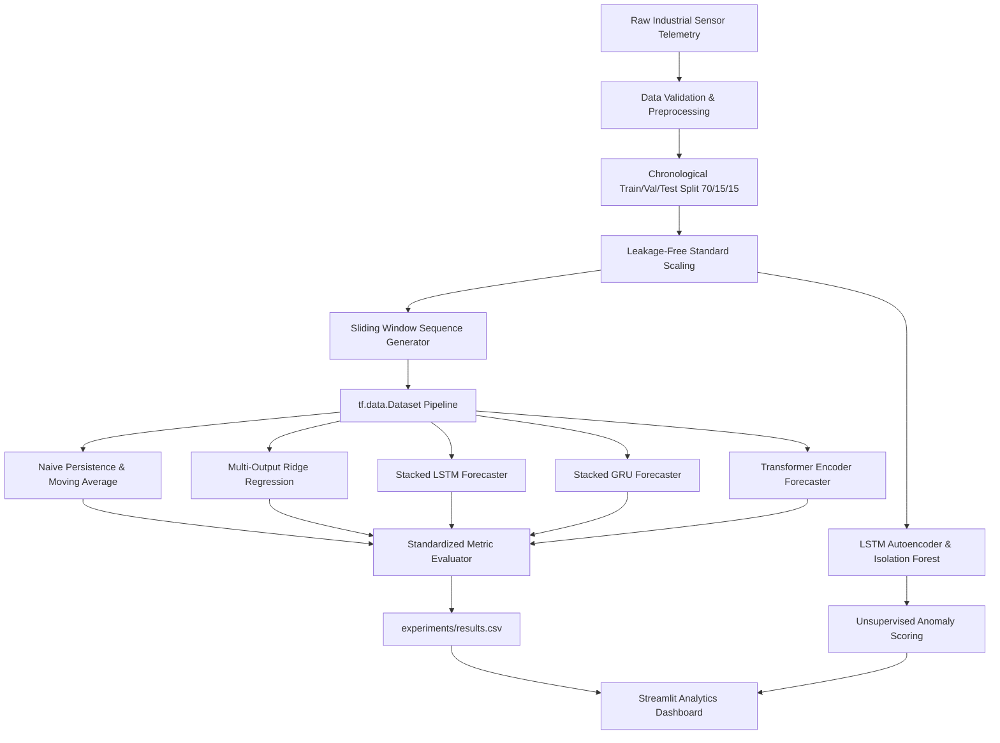

# Industrial Time-Series Intelligence Platform
> **Transformer-Based Multivariate Time-Series Forecasting & Unsupervised Anomaly Detection**  
> *Developed for AI/ML Research Internship Portfolio (Siemens Technology & Services)*

[](https://python.org)
[](https://tensorflow.org)
[](https://keras.io)
[](https://streamlit.io)
[](LICENSE)

---

## 📌 Executive Summary
The **Industrial Time-Series Intelligence Platform** is a research-grade machine learning system designed to monitor and forecast multi-channel sensor telemetry from industrial cyber-physical equipment (turbines, compressors, and rotating machinery).

Built strictly using **TensorFlow and Keras** (without any PyTorch dependencies), the project establishes a rigorous empirical benchmark comparing custom **Transformer Encoders**, **LSTMs**, **GRUs**, and **Classical Baselines**, paired with dual-paradigm **Anomaly Detection** (LSTM Autoencoder & Isolation Forest) and an interactive **Streamlit** dashboard.

---

## 🏗️ System Architecture



---

## ⚙️ Key Modules

1. **Leakage-Free Preprocessing (`src/data/preprocessing.py`)**:
   - Strict chronological train/validation/test partitioning (70/15/15).
   - Scaler fitted *strictly* on training split to eliminate data leakage.
2. **Transformer Encoder (`src/models/transformer.py`)**:
   - Implemented from scratch with sinusoidal positional encoding, Pre-LN architecture, and Multi-Head Attention (`tf.keras.layers.MultiHeadAttention`).
3. **Stacked Recurrent Baselines (`src/models/lstm.py`, `src/models/gru.py`)**:
   - Controlled stacked recurrent comparative baselines matching the same multi-step output tensor contract.
4. **Dual-Paradigm Anomaly Detection (`src/models/anomaly.py`)**:
   - Deep-learning sequence reconstruction error (LSTM Autoencoder) and statistical outlier isolation (Isolation Forest).
5. **Interactive UI (`app.py`)**:
   - Plotly-powered visual telemetry explorer, multi-step horizon forecast inspector, benchmark dashboard, and anomaly detection studio.

---

## 🚀 Quickstart Guide

### 1. Installation
```bash
# Clone the repository
git clone https://github.com/your-username/TimeSeriesGPT.git
cd TimeSeriesGPT

# Install dependencies
pip install -r requirements.txt
```

### 2. Prepare Industrial Data
```bash
python scripts/prepare_data.py
```

### 3. Train Models (Quick CPU-Friendly Mode)
The project includes a `--quick` mode optimized for testing without consuming local GPU resources:
```bash
# Classical baselines
python scripts/train.py --model naive
python scripts/train.py --model moving_average
python scripts/train.py --model ridge

# Deep learning models
python scripts/train.py --model lstm --quick
python scripts/train.py --model gru --quick
python scripts/train.py --model transformer --quick
```

### 4. Run Benchmarking & Anomaly Evaluation
```bash
python scripts/evaluate.py
```

### 5. Launch the Streamlit Platform
```bash
streamlit run app.py
```

### 6. Run Unit & Pipeline Tests
```bash
pytest tests/
```

---

## ☁️ Google Colab Execution (Zero Local GPU Burden)

If you prefer to train on Cloud GPUs instead of your local workstation:
1. Open Google Colab and select runtime: **Change runtime type -> T4 GPU**.
2. Clone this repository and run:
```bash
!git clone https://github.com/<your-username>/TimeSeriesGPT.git
%cd TimeSeriesGPT
!pip install -r requirements.txt

# Execute full GPU training
!python scripts/prepare_data.py
!python scripts/train.py --model transformer
!python scripts/evaluate.py
```

---

## 📊 Empirical Results (Physical Sensor Scale)

*All results recorded automatically in `experiments/results.csv` on physical sensor units:*

| Model | MAE | RMSE | MAPE (%) | sMAPE (%) | Training Time (s) | Parameter Count |
| :--- | :---: | :---: | :---: | :---: | :---: | :---: |
| **NAIVE** | 7.8974 | 16.0253 | 1.25% | 1.25% | 0.05 | 0 |
| **MOVING AVERAGE** | 6.3871 | 13.3377 | 0.94% | 0.94% | 0.05 | 0 |
| **RIDGE** | 5.8211 | 11.8451 | 0.92% | 0.92% | 0.05 | 29,400 |
| **TRANSFORMER (GPU Full)** | **5.9401** | **12.2426** | **0.91%** | **0.91%** | **58.94** | **92,998** |
| **GRU (GPU Full)** | 6.0982 | 12.4776 | 0.98% | 0.99% | 50.45 | 26,790 |
| **LSTM (GPU Full)** | 6.2323 | 12.6786 | 1.04% | 1.05% | 51.59 | 34,214 |

---

## 📄 License
This project is licensed under the MIT License - see the [LICENSE](LICENSE) file for details.
