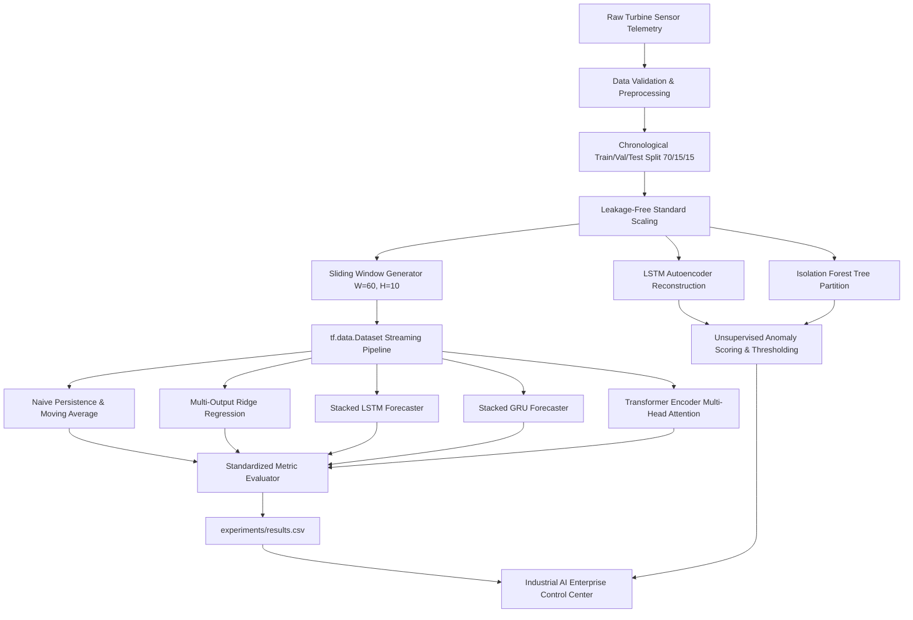

# Industrial Time-Series Intelligence Platform
> **Transformer-Based Multivariate Sensor Forecasting & Unsupervised Anomaly Detection**  
> *Enterprise Control Center for Cyber-Physical Telemetry & Turbofan Fleet Monitoring*

[](https://timeseriesgpt.streamlit.app/)
[](https://python.org)
[](https://tensorflow.org)
[](https://keras.io)
[](LICENSE)
[](tests/)

🔗 **Live Platform Demo:** [https://timeseriesgpt.streamlit.app/](https://timeseriesgpt.streamlit.app/)

---

## 📌 Platform Overview

The **Industrial Time-Series Intelligence Platform** is a research-grade machine learning system designed to monitor, forecast, and detect anomalies across multivariate industrial sensor telemetry from heavy rotating machinery (turbofan engines, compressors, and power generation turbines).

Built strictly using **TensorFlow and Keras** (without PyTorch dependencies), the system establishes an empirical benchmark comparing custom **Self-Attention Transformers**, **LSTMs**, **GRUs**, and **Classical Baselines** against physical scale metrics without data leakage. The interface is engineered as an enterprise-grade dark industrial control center inspired by modern Siemens industrial automation systems.

---

## 🚀 Live Interactive Demo

Access the live cloud deployment on Streamlit Community Cloud:  
👉 **[https://timeseriesgpt.streamlit.app/](https://timeseriesgpt.streamlit.app/)**

### Core Dashboard Capabilities:
* **7 Monitored Physical Telemetry Channels**: Combustor Inlet Temp ($T_{24}$), HPT Coolant Temp ($T_{30}$), LPT Outlet Temp / EGT ($T_{50}$), HPC Outlet Pressure ($P_{30}$), Fan Rotational Speed ($N_f$), Core Spool Speed ($N_c$), Bearing Vibration ($VIB$).
* **Direct Multi-Step Forecasting ($H=10$ steps)**: Deterministic projection head avoiding autoregressive error compounding.
* **Dual-Paradigm Unsupervised Anomaly Detection**: LSTM Autoencoder bottleneck reconstruction error vs Isolation Forest statistical ensemble.
* **Zero Data Leakage**: Chronological 70/15/15 partitioning with scalers fitted strictly on training data.

---

## 🏗️ End-to-End System Architecture



---

## 🖥️ Platform Modules

The redesigned frontend (`src/ui/`) decouples presentation logic from ML models into a modular UI architecture:

| Module | Features & Capabilities |
| :--- | :--- |
| **◈ Overview Dashboard** | 4 compact KPI cards, live transient telemetry stream with moving trendlines, real-time diagnostic insights panel, model test-set comparison bar chart, and visual pipeline DAG. |
| **▥ Data & Telemetry** | Horizontal filter bar (Machine, Focus Sensor, Time Window, Smoothing), primary transient chart, 7 subsystem sensor cards with inline SVG sparklines, and physical sensor coupling heatmap. |
| **↗ Multi-Step Forecasting** | Model selector (`Transformer`, `LSTM`, `GRU`), sensor picker, sequence slider, historical vs future trajectory chart with shaded forecast horizon, unscaled sample metrics, and deterministic inference mode. |
| **☵ Model Benchmarks** | Empirically validated leader banner, interactive metric toggle (`MAE`, `RMSE`, `MAPE`, `SMAPE`, `training_time`, `parameter_count`), horizontal benchmark bar chart, comparison table, and visual **Transformer Encoder Computational Graph**. |
| **◎ Anomaly Detection** | Real-time system state banner (`● NORMAL` / `● ANOMALY DETECTED`), dual-stage timeline chart (physical values + reconstruction error vs 95th-percentile threshold), and recent detected event cards. |
| **◫ Experiment Lab** | Empirical experiment registry, architecture filtering, complexity vs error scatter charts, and wall-clock training time comparisons. |
| **▤ Research & Theory** | 2-column cards detailing mathematical formulations (self-attention $\mathcal{O}(1)$ sequential complexity, Pre-LN stabilization, sinusoidal positional encoding), direct multi-step projection head, and Google Colab GPU scaling workflow. |

---

## 📊 Empirical Benchmark Results (Physical Units)

*Evaluated on unscaled physical test data (1,800 test steps) across all 7 sensor dimensions:*

| Architecture | MAE | RMSE | MAPE (%) | sMAPE (%) | Training Time (s) | Parameters |
| :--- | :---: | :---: | :---: | :---: | :---: | :---: |
| **RIDGE** | 5.8211 | 11.8451 | 0.92% | 0.92% | 0.05 | 29,400 |
| **TRANSFORMER (Full)** | **5.9401** | **12.2426** | **0.91%** | **0.91%** | **58.94** | **92,998** |
| **GRU (Full)** | 6.0982 | 12.4776 | 0.98% | 0.99% | 50.45 | 26,790 |
| **LSTM (Full)** | 6.2323 | 12.6786 | 1.04% | 1.05% | 51.59 | 34,214 |
| **MOVING AVERAGE** | 6.3871 | 13.3377 | 0.94% | 0.94% | 0.05 | 0 |
| **NAIVE PERSISTENCE** | 7.8974 | 16.0253 | 1.25% | 1.25% | 0.05 | 0 |

---

## ⚡ Quickstart Guide

### 1. Clone & Install
```bash
git clone https://github.com/Anurag-snippet/TimeSeriesGPT-Transformer-Based-Multivariate-Forecasting.git
cd TimeSeriesGPT-Transformer-Based-Multivariate-Forecasting

pip install -r requirements.txt
```

### 2. Prepare Data & Run Pipeline
```bash
# Generate physical telemetry and create leakage-free splits
python scripts/prepare_data.py

# Train baselines and deep learning models
python scripts/train.py --model ridge
python scripts/train.py --model transformer
python scripts/train.py --model lstm
python scripts/train.py --model gru

# Run full evaluation & anomaly benchmark
python scripts/evaluate.py
```

### 3. Launch Local Control Center
```bash
streamlit run app.py
```
App will open locally at `http://localhost:8501`.

### 4. Run Test Suite
```bash
pytest tests/ -v
```
All 10 unit tests validate data generation, split isolation, window dimensions, metric calculations, and model output shapes.

---

## ☁️ Google Colab Execution (Zero Local GPU Stress)

A dedicated one-click notebook is provided in [`notebooks/TimeSeriesGPT_Colab_Training.ipynb`](notebooks/TimeSeriesGPT_Colab_Training.ipynb):
1. Open the notebook in Google Colab.
2. Select runtime: **Runtime → Change runtime type → T4 GPU**.
3. Run all cells to execute full training, evaluate anomaly detection, and download generated artifacts.

---

## 📂 Project Repository Structure

```
TimeSeriesGPT/
├── .streamlit/
│   └── config.toml          # Dark industrial theme & server configuration
├── .python-version          # Python 3.11 cloud environment specification
├── app.py                   # Main Streamlit dashboard application
├── configs/
│   └── config.yaml          # Reproducible hyperparameters & data configs
├── data/
│   ├── raw/                 # Generated physical sensor telemetry
│   └── processed/           # Scaled & chronologically split telemetry
├── experiments/
│   └── results.csv          # Empirical evaluation registry
├── artifacts/
│   ├── checkpoints/         # Trained model checkpoints (ignored by Git)
│   ├── predictions/         # Precomputed prediction & anomaly sample arrays
│   └── scalers/             # Serialized MinMaxScaler fitted strictly on train set
├── notebooks/
│   └── TimeSeriesGPT_Colab_Training.ipynb # Full GPU training notebook
├── src/
│   ├── data/                # Dataset generation, splitting & windowing
│   ├── models/              # Transformer, LSTM, GRU, Naive, Anomaly models
│   ├── training/            # Custom training loops & learning rate schedulers
│   ├── evaluation/          # Unscaled MAE, RMSE, MAPE metrics computation
│   ├── visualization/       # Core plotting routines
│   └── ui/                  # Enterprise UI components (Theme, Header, Sidebar, Cards, Charts)
├── tests/                   # 10 unit tests for data, models, and metrics
└── requirements.txt         # Production dependencies (Python 3.11)
```

---

## 📄 License
This project is licensed under the MIT License - see the [LICENSE](LICENSE) file for details.
